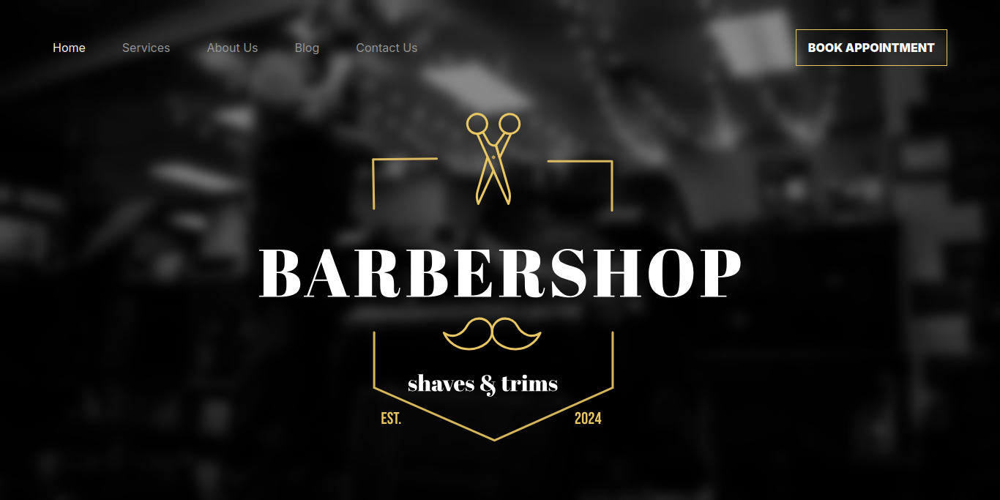

[TYPESCRIPT__BADGE]: https://img.shields.io/badge/TypeScript-3178C6?style=for-the-badge&logo=typescript&logoColor=white
[REACT__BADGE]: https://img.shields.io/badge/React-005CFE?style=for-the-badge&logo=react
[NEXTJS__BADGE]: https://img.shields.io/badge/Next.js-000000?style=for-the-badge&logo=nextdotjs&logoColor=white
[TAILWINDCSS__BADGE]: https://img.shields.io/badge/Tailwindcss-36b7f0?style=for-the-badge&logo=tailwindcss&logoColor=white
[NPM__BADGE]: https://img.shields.io/badge/npm-c53535?style=for-the-badge&logo=npm&logoColor=white
[ZOD__BADGE]: https://img.shields.io/badge/Zod-3E67B1?style=for-the-badge&logo=zod&logoColor=white
[REACTHOOKFORM__BADGE]: https://img.shields.io/badge/React_Hook_Form-EC5990?style=for-the-badge&logo=reacthookform&logoColor=white

<h1 align="center" style="font-weight: bold; font-size:2.5rem;">✂️ BARBERSHOP: Modern Barbershop Web App</h1>

<p align="center">
  <a href="https://barbershop-sandy-ten.vercel.app/">🚀 Live Demo</a> &nbsp;•&nbsp;
  <a href="https://www.figma.com/design/qNXZiNlAoGRAdz3QwczbgJ/Barbershop-Figma-Template--Community-?node-id=0-1&p=f&t=0xbPqLqADfr6OJ2h-0">🎨 View Figma Design</a>
</p>

<div align="center">

![npm][NPM__BADGE]
![nextjs][NEXTJS__BADGE]
![react][REACT__BADGE]
![typescript][TYPESCRIPT__BADGE]
![tailwindcss][TAILWINDCSS__BADGE]
![zod][ZOD__BADGE]
![reacthookform][REACTHOOKFORM__BADGE]

</div>

<p align="center">
 <a href="#about">About</a> •
 <a href="#started">Getting Started</a> •
 <a href="#routes">Application Routes</a>
</p>

<p align="center">
  <a href="https://barbershop-sandy-ten.vercel.app/">
    
  </a>
</p>

<h2 id="about">📌 About</h2>

<p>
A fully responsive, modern barbershop website built with Next.js 16, React 19, TypeScript, and Tailwind CSS v4. Designed from a professional Figma template, the site showcases barbershop services, customer testimonials, brand partners, and a contact form — delivering a premium web presence for any barbershop business.
</p>

Key Features:

=> <span style='font-weight:700;'>Hero Section</span>: Full-screen background with logo overlay and a compelling call to action.

=> <span style='font-weight:700;'>Services Showcase</span>: Dynamic service cards pulled from a centralized data source, with an "Explore Now" CTA.

=> <span style='font-weight:700;'>Statistics Counter</span>: Animated counters highlighting key business milestones.

=> <span style='font-weight:700;'>Banner / Promo Section</span>: Eye-catching promotional banner for special offers.

=> <span style='font-weight:700;'>Testimonials</span>: Customer reviews section to build trust and credibility.

=> <span style='font-weight:700;'>Brand Partners</span>: Logos of affiliated and partner brands.

=> <span style='font-weight:700;'>Contact Form</span>: Validated contact form built with React Hook Form and Zod schema validation.

=> <span style='font-weight:700;'>Responsive UI</span>: Mobile-first design with a dedicated mobile navigation drawer.

=> <span style='font-weight:700;'>Blog Section</span>: Dedicated blog page for articles and updates.

<h2 id="started">🚀 Getting Started</h2>

<h3>Prerequisites</h3>

- [Node.js](https://nodejs.org) (v18 or higher recommended)
- [Git](https://git-scm.com/downloads)
- [npm](https://www.npmjs.com)

<h3>Cloning</h3>

```bash
git clone https://github.com/BekaAbate/barbershop.git
```

<h3>Installing & Running</h3>

```bash
cd barbershop
npm install
npm run dev
```

Open [http://localhost:3000](http://localhost:3000) in your browser to see the result.

<h3>Building for Production</h3>

```bash
npm run build
npm start
```

<h2 id="routes">📍 Application Routes</h2>

| Route | Description |
| ----- | ----------- |
| <kbd>/</kbd> | Home page — Hero, Services, Counter, Banner, Testimonials, Brands |
| <kbd>/about</kbd> | About page — barbershop story and team |
| <kbd>/services</kbd> | Full services listing page |
| <kbd>/blog</kbd> | Blog page — articles and updates |
| <kbd>/contact</kbd> | Contact page with validated form |

<h2>🎨 Design</h2>

This project was built based on a professional Figma community template.

👉 [View the Figma Design](https://www.figma.com/design/qNXZiNlAoGRAdz3QwczbgJ/Barbershop-Figma-Template--Community-?node-id=0-1&p=f&t=0xbPqLqADfr6OJ2h-0)

<h2>🛠️ Tech Stack</h2>

| Technology | Purpose |
| ---------- | ------- |
| Next.js 16 | Full-stack React framework with App Router |
| React 19 | UI component library |
| TypeScript | Static typing |
| Tailwind CSS v4 | Utility-first styling |
| React Hook Form | Performant form state management |
| Zod | Schema-based form validation |
| clsx / tailwind-merge | Conditional class utilities |
